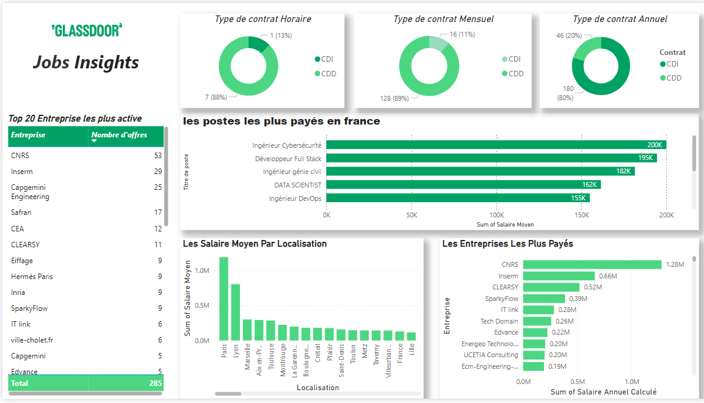

# Scraping Data & Visualisation Power BI - Glassdoor Project

## 📝 Description
Ce projet est divisé en deux parties principales :

1. **Data Scraping** : Extraction de données des offres d'emploi sur Glassdoor à l'aide de Selenium et BeautifulSoup.
2. **Data Cleaning & Preparing** : Nettoyage et structuration des données dans Excel pour l'analyse.
3. **Power BI** : Analyse et visualisation des données sous forme de tableau de bord interactif.

---

## 🚀 Fonctionnalités

### **Data Scraping**
- Extraction des informations des offres d'emploi (titre, entreprise, localisation, salaire, type de contrat).
- Gestion des erreurs et pauses aléatoires pour éviter les détections de bot.
- Enregistrement des résultats au format CSV.

### **Microsoft Excel**
- Suppression des valeurs manquantes.
- Ajout de colonnes pertinentes.
- Structuration des données pour l'analyse.

### **Power BI**
- Visualisation des tendances d'emploi (types de contrat, salaires, etc.).
- Création d'un tableau de bord interactif pour explorer les données.

---

## 📊 Mesures dans Power BI

Voici les mesures personnalisées utilisées dans Power BI pour l'analyse :

1. **Nombre d'offres**
   ```DAX
   Nombre d'offres = CALCULATE(COUNTROWS('Dataset_Clean_glassdoor'), ALLEXCEPT('Dataset_Clean_glassdoor', 'Dataset_Clean_glassdoor'[Entreprise]))


2. **Nombre_Offres_Par_Titre**
   ```DAX
   Nombre_Offres_Par_Titre = COUNTROWS(Dataset_Clean_glassdoor)


3. **Nombre_CDD_Annuel**
   ```DAX
   Nombre_CDD_Annuel = 
   CALCULATE(
       COUNTROWS(Dataset_Clean_glassdoor),
       Dataset_Clean_glassdoor[Contrat] = "CDD" && Dataset_Clean_glassdoor[Type de salaire] = "Annuel"
   )

4. **Nombre_CDI_Annuel**
   ```DAX
   Nombre_CDI_Annuel = 
   CALCULATE(
       COUNTROWS(Dataset_Clean_glassdoor),
       Dataset_Clean_glassdoor[Contrat] = "CDI" && Dataset_Clean_glassdoor[Type de salaire] = "Annuel"
   )

5. **Nombre_CDD_Mensuel**
   ```DAX
   Nombre_CDD_Mensuel = 
   CALCULATE(
       COUNTROWS(Dataset_Clean_glassdoor),
       Dataset_Clean_glassdoor[Contrat] = "CDD" && Dataset_Clean_glassdoor[Type de salaire] = "Mensuel"
   )

6. **Nombre_CDI_Mensuel**
   ```DAX
   Nombre_CDI_Mensuel = 
   CALCULATE(
       COUNTROWS(Dataset_Clean_glassdoor),
       Dataset_Clean_glassdoor[Contrat] = "CDI" && Dataset_Clean_glassdoor[Type de salaire] = "Mensuel"
   )

7. **Nombre_CDD_Horaire**
   ```DAX
    Nombre_CDD_Horaire = 
   CALCULATE(
       COUNTROWS(Dataset_Clean_glassdoor),
       Dataset_Clean_glassdoor[Contrat] = "CDD" && Dataset_Clean_glassdoor[Type de salaire] = "Horaire"
   )
8. **Nombre_CDI_Horaire**
   ```DAX
   Nombre_CDI_Horaire = 
   CALCULATE(
       COUNTROWS(Dataset_Clean_glassdoor),
       Dataset_Clean_glassdoor[Contrat] = "CDI" && Dataset_Clean_glassdoor[Type de salaire] = "Horaire"
   )
## 📁 Structure des Dossiers  
- **`data/`** : Contient les données brutes et nettoyées.  
- **`scraping/`** : Scripts Python pour l'extraction des données.  
- **`powerbi/`** : Fichier Power BI et captures d'écran du tableau de bord.  
- **`README/`** : Guides et documentations   

---

## 📷 Capture d'écran du Tableau de Bord
-- Voici un aperçu du tableau de bord Power BI créé à partir des données Glassdoor :



 

---


## 🛠️ Installation et Utilisation  

### Pré-requis  
- Python 3.x
- Chromedriver 
- Selenium et BeautifulSoup
- Microsoft Excel
- Power BI Desktop  


---

## 🛠️ Étapes du Projet  

### **1. Scraping des Données**  
**Outils et bibliothèques utilisés** :  
- `Python`, `Jupyter Notebook`  
- `Selenium`, `BeautifulSoup`, `Pandas`  
- `Chromedriver`  

**Étapes suivies** :  
1. **Configuration de Selenium** :  
   - Utilisation de *Chromedriver* pour automatiser la navigation.  
   - Ajout d’un *user-agent* et désactivation de la détection d'automatisation.  

2. **Extraction des URL à scraper** :  
   - Génération des URLs dynamiquement pour différents intitulés de poste et types de contrat (CDI, CDD).  

3. **Développement du script de scraping** :  
   - Collecte des données suivantes pour chaque offre :  
     - **Titre du poste**  
     - **Nom de l'entreprise**  
     - **Localisation**  
     - **Salaire estimé**  
     - **Type de contrat (CDI, CDD)**  

4. **Gestion des erreurs et pauses aléatoires** :  
   - Ajout de pauses pour simuler une navigation humaine.  
   - Enregistrement des erreurs dans un fichier log (`scraping_errors.log`).  

5. **Enregistrement des données** :  
   - Sauvegarde des données dans un fichier CSV nommé `glassdoor_jobs_dataset.csv`.  


### 2. Préparation des Données dans Excel
- Suppression des valeurs manquantes.  
- Ajout de colonnes pour structurer les données.  

---

### 3. Analyse et Visualisation dans Power BI
- Importation des données nettoyées.  
- Création de mesures personnalisées (voir la section "Mesures dans Power BI").  
- Conception du tableau de bord interactif pour explorer et analyser les données.  
